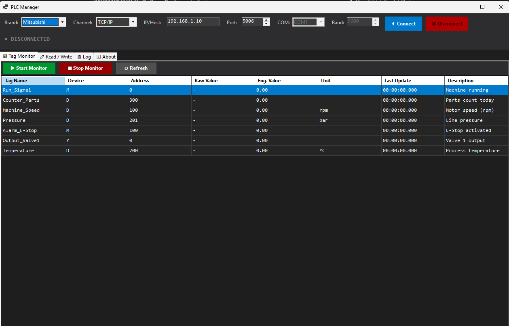

# PLC Manager — WinForms Template

> **Full-stack C# WinForms project** covering OOP, Multi-threading, TCP/IP Socket, RS-232,  
> PLC protocol implementation (M SLMP, MC Protocol, Omron FINS/TCP),  
> and Team Lead architecture patterns.

---

## 📁 Project Structure

```
PLCManager/
│
├── Core/                          ← Domain Layer (no external dependencies)
│   ├── Enums/
│   │   └── PLCEnums.cs            ← PLCBrand, DeviceType, ConnectionState, LogLevel…
│   ├── Models/
│   │   └── PLCModels.cs           ← ConnectionConfig, PLCTag, PLCResult<T>, AlarmItem…
│   └── Interfaces/
│       └── IPLCCommunication.cs   ← IPLCCommunication, ITagMonitor, IAppLogger,
│                                     IPLCConnectionFactory, ITagRepository
│
├── Communication/
│   └── PLC/
│       └── PLCCommunicationBase.cs ← Abstract base: Template Method, retry, semaphore lock,
│                                      statistics, thread-safe send, IDisposable
│
├── Protocols/
│   ├── Mitsubishi/
│   │   ├── MitsubishiTcpDriver.cs  ← MELSEC SLMP 3E Binary Frame (TCP/IP)
│   │   └── MitsubishiSerialDriver.cs ← MC Protocol ASCII 1C Frame (RS-232)
│   └── Omron/
│       └── OmronFinsDriver.cs      ← FINS/TCP with node handshake
│
├── Services/
│   ├── PLCServices.cs             ← PLCConnectionFactory (Factory Pattern)
│   │                                 TagMonitorService (Producer-Consumer, Observer)
│   └── AppLoggerAndRepo.cs        ← AppLogger (Singleton, thread-safe, async file write)
│                                     TagRepository (JSON persistence)
│
├── UI/
│   └── Forms/
│       └── MainForm.cs            ← WinForms UI: dark theme, InvokeRequired, async event handlers
│
├── Program.cs                     ← Entry point, global exception handlers
└── PLCManager.csproj              ← .NET 8 WinForms project file
```

---

## 🏗️ Architecture Patterns (Team Lead)

| Pattern | Where Used |
|---|---|
| **Template Method** | `PLCCommunicationBase` — base handles retry, locking, stats; subclasses implement protocol |
| **Factory** | `PLCConnectionFactory.Create(config)` — returns correct driver by brand+channel |
| **Singleton** | `AppLogger.Instance` — one logger for the whole app |
| **Observer (Events)** | `ConnectionStateChanged`, `ErrorOccurred`, `TagValueChanged`, `LogAdded` |
| **Repository** | `TagRepository` — CRUD + JSON persistence for PLCTag configs |
| **Strategy** | Swap Mitsubishi ↔ Omron at runtime via same `IPLCCommunication` interface |
| **Producer-Consumer** | `TagMonitorService` — poll tasks produce values, UI consumes via events |
| **Result Wrapper** | `PLCResult<T>` — no raw exceptions bubble to UI; always check `.Success` |

---

## 🔌 PLC Protocols Implemented

### Mitsubishi MELSEC SLMP (TCP/IP)
- **Frame type**: 3E Binary Frame
- **Port**: 5006 (default)
- **Commands**: Batch Read/Write Word (0401/1401), Batch Read/Write Bit
- **Devices**: X, Y, M, L, F, B, D, W, R, TN, CN
- **Reference**: MELSEC Communication Protocol Reference (SH-080008)

```
Request Frame (3E Binary):
┌──────────┬────────┬──────┬────────┬───────┬─────────┬──────────────┐
│Subheader │Network │PC No │UnitIO  │UnitNo │DataLen  │  CmdData     │
│ 50 00    │  xx    │  xx  │  FF 03 │  00   │  xx xx  │ CMD+Data...  │
└──────────┴────────┴──────┴────────┴───────┴─────────┴──────────────┘
```

### Mitsubishi MC Protocol (RS-232)
- **Frame type**: ASCII 1C/4C Frame
- **Format**: `STX | NetworkNo | PcNo | UnitIO | UnitNo | Timer | CMD | ... | ETX | BCC`
- **BCC**: XOR checksum of all ASCII chars between STX and ETX

### Omron FINS/TCP
- **Port**: 9600 (default)
- **Handshake**: Client sends node-address request, server assigns node
- **Frame**: FINS/TCP header (20 bytes) + FINS header (10 bytes) + command data
- **Memory Areas**: CIO (0xB0/0x30), DM (0x82), HR (0xB2), AR (0xB3)
- **Reference**: Omron W227-E1 FINS Commands Reference

---

## 🧵 Multi-threading Details

```csharp
// SemaphoreSlim — ensures only one request on the bus at a time
private readonly SemaphoreSlim _sendLock = new(1, 1);

// Each monitor group runs on its own Task (LongRunning for high-priority)
Task.Factory.StartNew(() => PollGroupAsync(group, ct),
    TaskCreationOptions.LongRunning, TaskScheduler.Default);

// Cross-thread UI update (WinForms thread safety)
if (_gridTags.InvokeRequired)
    _gridTags.BeginInvoke(() => UpdateRow(tag));

// CancellationToken flows through all async operations
using var cts = CancellationTokenSource.CreateLinkedTokenSource(ct);
cts.CancelAfter(timeoutMs);
await _stream.ReadAsync(buffer, cts.Token);

// Interlocked for lock-free statistics counters
Interlocked.Increment(ref _stats.TotalRequests);

// BlockingCollection for async log file writer
private readonly BlockingCollection<LogEntry> _writeQueue = new(5000);
// Consumer:
foreach (var entry in _writeQueue.GetConsumingEnumerable(ct))
    _fileWriter?.WriteLine(entry.ToString());
```

---

## 🚀 Build & Run

### Requirements
- .NET 8 SDK
- Windows (WinForms)
- Visual Studio 2022 or `dotnet build`

```bash
# Build
dotnet build PLCManager.csproj

# Run (with real PLC)
dotnet run --project PLCManager.csproj

# Publish single-file exe
dotnet publish -c Release -r win-x64 --self-contained false
```

---

## ➕ Extending — Add a New PLC Driver

1. Implement `PLCCommunicationBase` → override 6 abstract methods
2. Add new `case` in `PLCConnectionFactory.Create()`
3. No other code changes needed (Open/Closed Principle ✓)

```csharp
public class SiemensTcpDriver : PLCCommunicationBase
{
    protected override async Task<PLCResult<short[]>> ReadWordsCoreAsync(...) 
    {
        // Implement S7 protocol here
    }
    // ... other overrides
}
```

---

## 📋 Tag Configuration (JSON)

```json
[
  {
    "TagName": "Machine_Speed",
    "Device": "D",
    "Address": 100,
    "Length": 1,
    "IsBit": false,
    "Scale": 0.1,
    "Unit": "rpm",
    "Description": "Motor speed"
  },
  {
    "TagName": "Run_Signal",
    "Device": "M",
    "Address": 0,
    "IsBit": true,
    "Description": "Machine running bit"
  }
]
```

Load: `tagRepo.LoadFromFile("tags.json")`  
Save: `tagRepo.SaveToFile("tags.json")`

---

## 🛡️ Error Handling Strategy

```
PLC Hardware
    ↓ Exception
PLCCommunicationBase.ReadWordsAsync()
    ↓ catches → PLCResult<T>.Fail(msg)
TagMonitorService.PollGroupOnceAsync()
    ↓ ignores failed reads (logs warning)
UI EventHandler
    ↓ checks result.Success
MainForm.ShowError() or AppendResult()
```

No raw exceptions reach the UI — all errors are wrapped in `PLCResult<T>`.

---

*Template by Senior Dev — covers all interview requirements for Industrial Automation C# positions.*
# PLCManager
